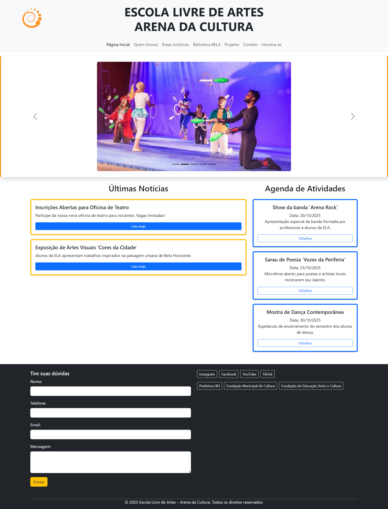
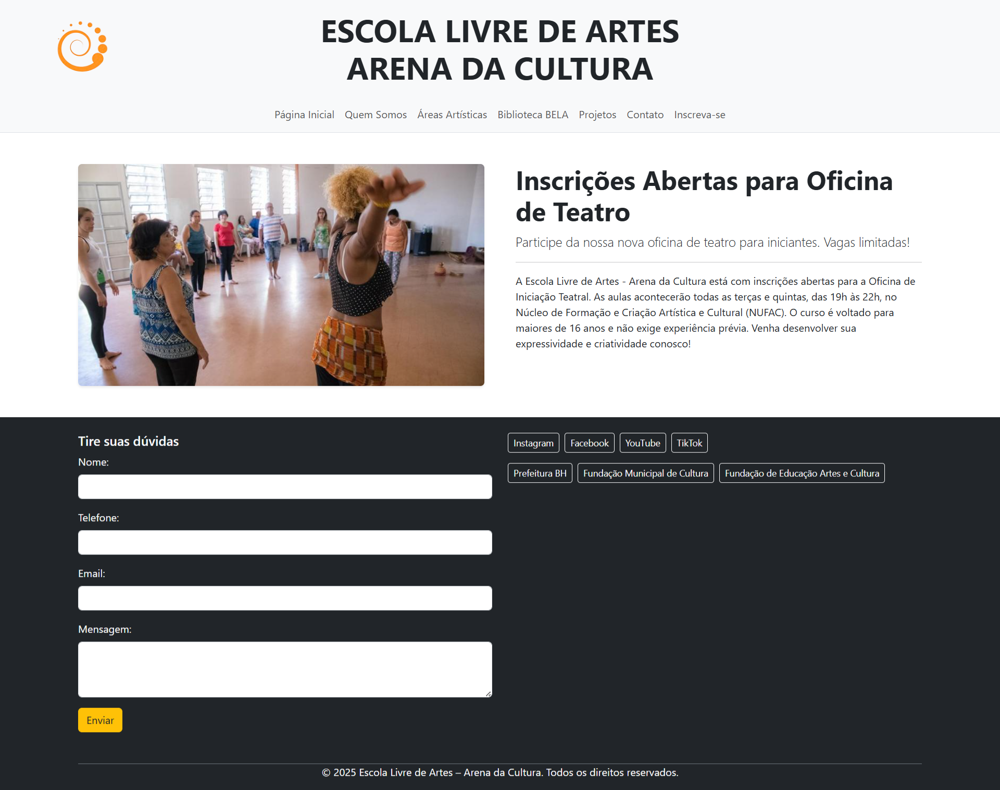
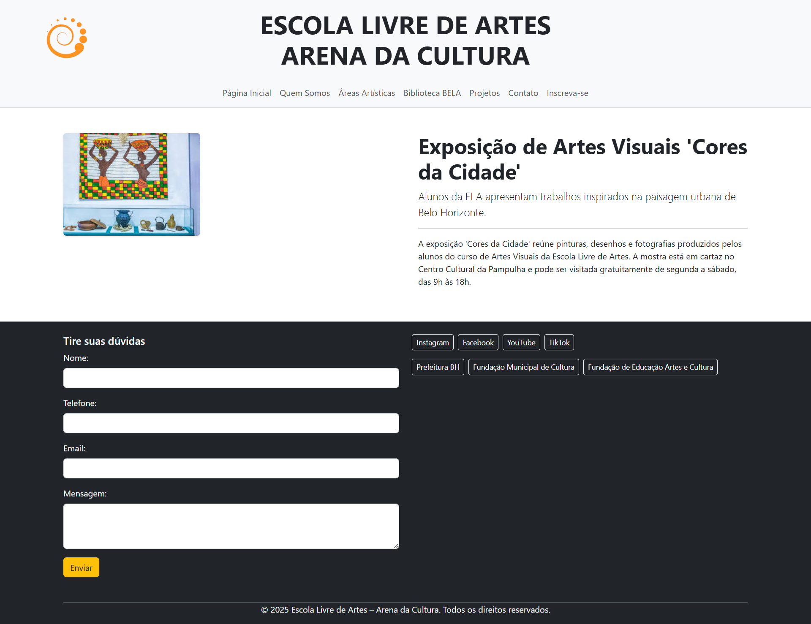
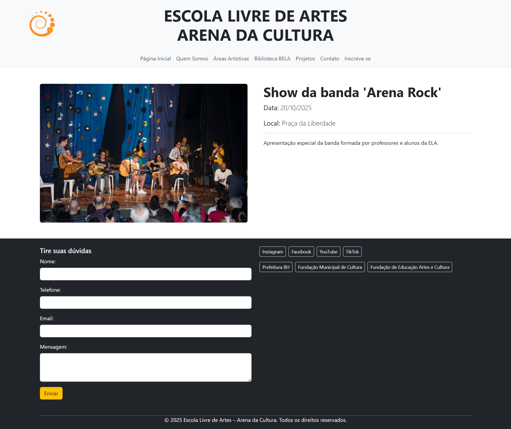
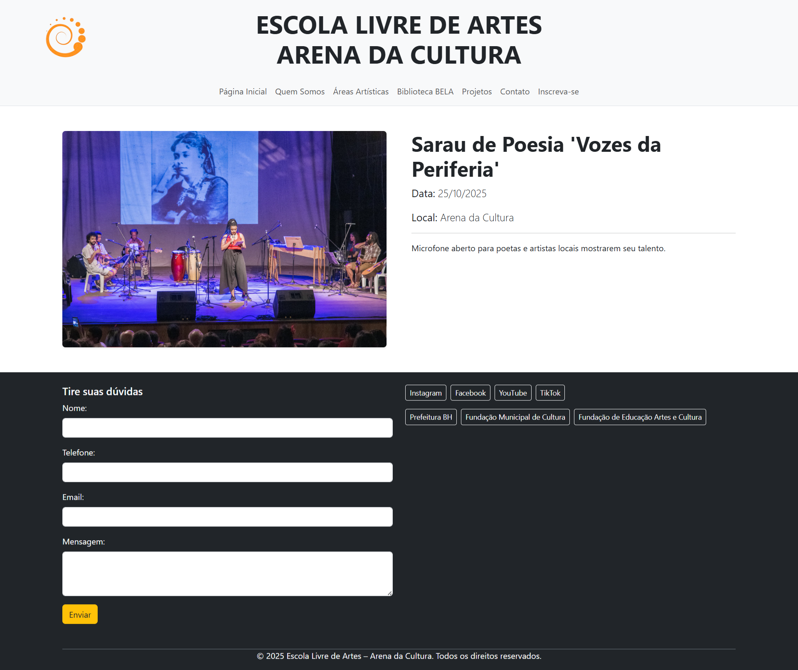
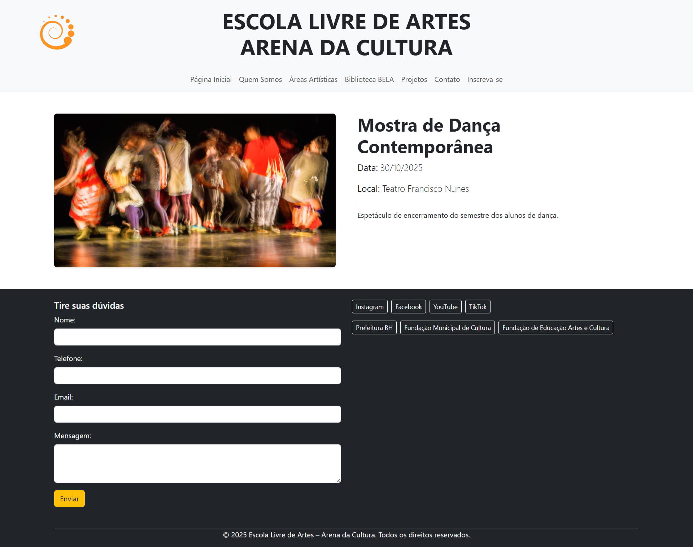

[](https://classroom.github.com/online_ide?assignment_repo_id=20650154&assignment_repo_type=AssignmentRepo)
# Trabalho Prático 05 - Semanas 7 e 8

**Páginas de detalhes dinâmicas**

Nessa etapa, vamos evoluir o trabalho anterior, acrescentando a página de detalhes, conforme o  projeto escolhido. Imagine que a página principal (home-page) mostre um visão dos vários itens que existem no seu site. Ao clicar em um item, você é direcionado pra a página de detalhes. A página de detalhe vai mostrar todas as informações sobre o item do seu projeto. seja esse item uma notícia, filme, receita, lugar turístico ou evento.

Leia o enunciado completo no Canvas. 

**IMPORTANTE:** Assim como informado anteriormente, capriche na etapa pois você vai precisar dessa parte para as próximas semanas. 

**IMPORTANTE:** Você deve trabalhar e alterar apenas arquivos dentro da pasta **`public`,** mantendo os arquivos **`index.html`**, **`styles.css`** e **`app.js`** com estes nomes, conforme enunciado. Deixe todos os demais arquivos e pastas desse repositório inalterados. **PRESTE MUITA ATENÇÃO NISSO.**

## Informações Gerais

- Nome: Rafael Vasconcelos de Assis
- Matricula: 898374
- Proposta de projeto escolhida: Organizações e Equipes
- Breve descrição sobre seu projeto: Este projeto consiste no desenvolvimento de uma aplicação web para a Escola Livre de Artes – Arena da Cultura, com o objetivo de tornar mais acessíveis as informações sobre a escola, cursos, oficinas e eventos da instituição.

## Print da Home-Page



## Print da página de detalhes do item

 

 

 

 

 

## Cole aqui abaixo a estrutura JSON utilizada no app.js

```javascript
const dados = {
  "noticias": [
    {
      "id": 1,
      "titulo": "Inscrições Abertas para Oficina de Teatro",
      "descricao": "Participe da nossa nova oficina de teatro para iniciantes. Vagas limitadas!",
      "conteudo": "A Escola Livre de Artes - Arena da Cultura está com inscrições abertas para a Oficina de Iniciação Teatral. As aulas acontecerão todas as terças e quintas, das 19h às 22h, no Núcleo de Formação e Criação Artística e Cultural (NUFAC). O curso é voltado para maiores de 16 anos e não exige experiência prévia. Venha desenvolver sua expressividade e criatividade conosco!",
      "imagem": "/public/images/teatro-NUFAC-ELA.jpg"
    },
    {
      "id": 2,
      "titulo": "Exposição de Artes Visuais 'Cores da Cidade'",
      "descricao": "Alunos da ELA apresentam trabalhos inspirados na paisagem urbana de Belo Horizonte.",
      "conteudo": "A exposição 'Cores da Cidade' reúne pinturas, desenhos e fotografias produzidos pelos alunos do curso de Artes Visuais da Escola Livre de Artes. A mostra está em cartaz no Centro Cultural da Pampulha e pode ser visitada gratuitamente de segunda a sábado, das 9h às 18h.",
      "imagem": "/public/images/Artes-Visuais-ELA.jpg"
    }
  ],
  "eventos": [
    {
      "id": 3,
      "titulo": "Show da banda 'Arena Rock'",
      "data": "20/10/2025",
      "descricao": "Apresentação especial da banda formada por professores e alunos da ELA.",
      "local": "Praça da Liberdade",
      "imagem": "/public/images/Arena-Rock.jpg"
    },
    {
      "id": 4,
      "titulo": "Sarau de Poesia 'Vozes da Periferia'",
      "data": "25/10/2025",
      "descricao": "Microfone aberto para poetas e artistas locais mostrarem seu talento.",
      "local": "Arena da Cultura",
      "imagem": "/public/images/Sarau-Poesia.jpg"
    },
    {
      "id": 5,
      "titulo": "Mostra de Dança Contemporânea",
      "data": "30/10/2025",
      "descricao": "Espetáculo de encerramento do semestre dos alunos de dança.",
      "local": "Teatro Francisco Nunes",
      "imagem": "/public/images/banner4.jpg"
    }
  ]
};
```